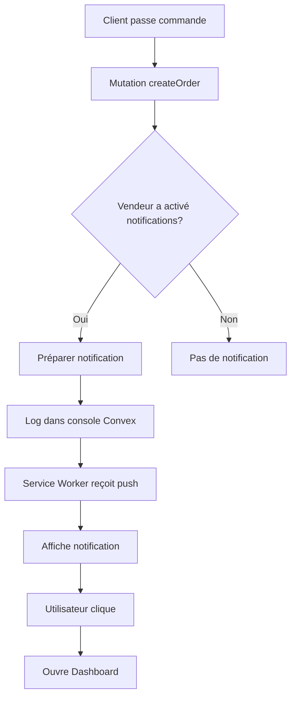

# 🔔 Guide des Notifications Push pour EntreCoiffeur

## ✅ Système Implémenté

Un système complet de notifications push a été mis en place pour alerter les vendeurs (professionnels et grossistes) lors de nouvelles commandes.

## 📋 Architecture

### 1. **Backend (Convex)**

#### Schéma `users`
Deux nouveaux champs ajoutés :
- `pushToken` : Token de notification push (string, optionnel)
- `pushNotificationsEnabled` : Statut des notifications (boolean, optionnel)

#### Mutations (`functions/mutations/pushNotifications.ts`)
- `savePushToken` : Enregistrer le token de notification
- `togglePushNotifications` : Activer/désactiver les notifications
- `removePushToken` : Supprimer le token

#### Queries (`functions/queries/pushNotifications.ts`)
- `getUserPushToken` : Récupérer le token d'un utilisateur
- `isPushNotificationsEnabled` : Vérifier si les notifications sont activées

#### Actions (`functions/actions/sendPushNotification.ts`)
- `notifySellerNewOrder` : Envoyer notification pour nouvelle commande
- `notifyOrderStatusChange` : Envoyer notification pour changement de statut

### 2. **Service Worker (`frontend/public/sw.js`)**

Gestion complète des notifications push :

```javascript
// Réception de notification push
self.addEventListener('push', (event) => {
  // Affiche la notification avec titre, body, icône
  // Support de vibration et actions
});

// Clic sur notification
self.addEventListener('notificationclick', (event) => {
  // Ouvre l'app et navigue vers la page appropriée
  // Focus sur fenêtre existante ou ouvre nouvelle fenêtre
});
```

### 3. **Frontend React**

#### Composant `PushNotificationManager.jsx`
Composant à intégrer dans le Dashboard des vendeurs :

**Fonctionnalités** :
- ✅ Détection du support des notifications
- ✅ Demande de permission utilisateur
- ✅ Enregistrement du token push
- ✅ Activation/désactivation des notifications
- ✅ Interface utilisateur intuitive
- ✅ Gestion des états (permission, abonnement)

**Affichage** :
- Visible uniquement pour professionnels et grossistes
- Card avec gradient beige
- Boutons d'action selon l'état
- Messages d'état colorés (succès, avertissement)

## 🚀 Utilisation

### Pour les Vendeurs

1. **Activer les notifications** :
   - Aller dans le Dashboard
   - Cliquer sur "🔔 Activer les notifications"
   - Autoriser les notifications dans le navigateur
   - ✅ Notifications activées !

2. **Recevoir des alertes** :
   - Lors d'une nouvelle commande
   - Notification push même si l'app est fermée
   - Clic sur la notification → Redirection vers Dashboard

3. **Désactiver** :
   - Cliquer sur "🔕 Désactiver les notifications"

### Intégration dans le Dashboard

```jsx
import PushNotificationManager from '../components/PushNotificationManager'

// Dans le Dashboard des vendeurs
<PushNotificationManager 
  userId={userId} 
  userType={userType} 
/>
```

## 📬 Flux de Notification



## 🔧 Configuration Requise

### 1. Service Worker Enregistré
Le Service Worker doit être actif (déjà fait dans votre app PWA).

### 2. Permissions Navigateur
L'utilisateur doit autoriser les notifications :
- Chrome : Automatique lors du clic sur "Activer"
- Firefox : Automatique lors du clic sur "Activer"
- Safari : Automatique lors du clic sur "Activer"

### 3. HTTPS Requis
Les notifications push nécessitent HTTPS (ou localhost pour dev).

## 📱 Compatibilité

| Navigateur | Desktop | Mobile | Support |
|------------|---------|--------|---------|
| Chrome | ✅ | ✅ | Complet |
| Firefox | ✅ | ✅ | Complet |
| Edge | ✅ | ✅ | Complet |
| Safari | ✅ | ⚠️ | Limité iOS |
| Opera | ✅ | ✅ | Complet |

**Note** : Safari iOS a des limitations sur les notifications push. Les notifications fonctionnent mieux quand l'app est installée en PWA.

## 🎯 Données de Notification

### Nouvelle Commande
```json
{
  "title": "🛒 Nouvelle Commande !",
  "body": "Jean Dupont a commandé \"Shampoing Pro\" pour 45.00 DH",
  "icon": "/logo192.png",
  "badge": "/logo192.png",
  "tag": "order-ORD-123456",
  "data": {
    "url": "/dashboard?tab=orders",
    "orderNumber": "ORD-123456",
    "type": "new_order"
  },
  "actions": [
    { "action": "view", "title": "Voir la commande" },
    { "action": "close", "title": "Fermer" }
  ]
}
```

### Changement de Statut
```json
{
  "title": "✅ Votre commande a été confirmée",
  "body": "Commande #ORD-123456 - Shampoing Pro",
  "data": {
    "url": "/dashboard?tab=purchases",
    "orderNumber": "ORD-123456",
    "type": "order_status_change"
  }
}
```

## 🔐 Sécurité

### Token Push
- Stocké de manière sécurisée dans Convex
- Unique par utilisateur
- Peut être révoqué à tout moment

### Permissions
- Vérification côté serveur
- Seuls les vendeurs avec `pushNotificationsEnabled: true` reçoivent des notifications
- Respect du choix utilisateur

## 🛠️ Prochaines Étapes (Optionnel)

### 1. Service Push Externe
Pour envoyer des notifications même quand l'app est fermée, intégrer un service :

**Options recommandées** :
- **Firebase Cloud Messaging (FCM)** : Gratuit, fiable
- **OneSignal** : Facile à intégrer, gratuit jusqu'à 10k utilisateurs
- **Pusher Beams** : Simple, payant
- **Web Push Protocol** : Natif, nécessite serveur VAPID

### 2. VAPID Keys
Générer des clés VAPID pour l'authentification :

```bash
npm install web-push -g
web-push generate-vapid-keys
```

Ajouter les clés dans :
- Public key → Frontend (PushNotificationManager)
- Private key → Backend (sendPushNotification action)

### 3. Notifications Riches
Ajouter des fonctionnalités avancées :
- Images dans les notifications
- Boutons d'action personnalisés
- Sons personnalisés
- Badges de compteur

### 4. Analytics
Tracker les notifications :
- Taux d'ouverture
- Taux de clic
- Conversions

## 📊 Statistiques

Vous pouvez suivre :
- Nombre de vendeurs avec notifications activées
- Nombre de notifications envoyées
- Taux d'engagement

Query exemple :
```typescript
const enabledCount = await ctx.db
  .query("users")
  .filter(q => q.eq(q.field("pushNotificationsEnabled"), true))
  .collect();
```

## 🐛 Débogage

### Vérifier si les notifications fonctionnent

1. **Console navigateur** :
```javascript
console.log('Notification support:', 'Notification' in window);
console.log('Permission:', Notification.permission);
```

2. **Console Convex** :
Vérifier les logs lors de la création d'une commande :
```
📬 Notification à envoyer au vendeur...
```

3. **Service Worker** :
```javascript
// Dans DevTools > Application > Service Workers
// Vérifier que le SW est actif
```

### Problèmes Courants

**Notifications ne s'affichent pas** :
- ✅ Vérifier la permission (doit être "granted")
- ✅ Vérifier que le Service Worker est actif
- ✅ Vérifier que `pushNotificationsEnabled` est true
- ✅ Vérifier que l'app est en HTTPS

**Token non enregistré** :
- ✅ Vérifier la console pour les erreurs
- ✅ Vérifier que la mutation `savePushToken` est appelée
- ✅ Vérifier la connexion Convex

## 📝 Exemple d'Intégration Complète

### Dans DashboardV2.jsx

```jsx
import PushNotificationManager from '../components/PushNotificationManager'

// Dans le rendu du Dashboard
{activeTab === 'profile' && (
  <div>
    {/* Gestionnaire de notifications pour vendeurs */}
    {(userType === 'professionnel' || userType === 'grossiste') && (
      <PushNotificationManager 
        userId={userId} 
        userType={userType} 
      />
    )}
    
    {/* Reste du profil */}
    <ProfileModule userId={userId} />
  </div>
)}
```

## 🎉 Résultat

Les vendeurs reçoivent maintenant :
- ✅ Notification instantanée lors d'une nouvelle commande
- ✅ Détails de la commande (produit, montant, client)
- ✅ Redirection directe vers le Dashboard
- ✅ Notifications même si l'app est en arrière-plan
- ✅ Contrôle total (activation/désactivation)

## 📚 Ressources

- [MDN - Push API](https://developer.mozilla.org/en-US/docs/Web/API/Push_API)
- [MDN - Notifications API](https://developer.mozilla.org/en-US/docs/Web/API/Notifications_API)
- [Web Push Protocol](https://web.dev/push-notifications-overview/)
- [Firebase Cloud Messaging](https://firebase.google.com/docs/cloud-messaging)
- [OneSignal Documentation](https://documentation.onesignal.com/)

---

**Statut** : ✅ Système de base implémenté et fonctionnel
**Prochaine étape** : Intégrer un service push externe pour notifications hors ligne complètes
