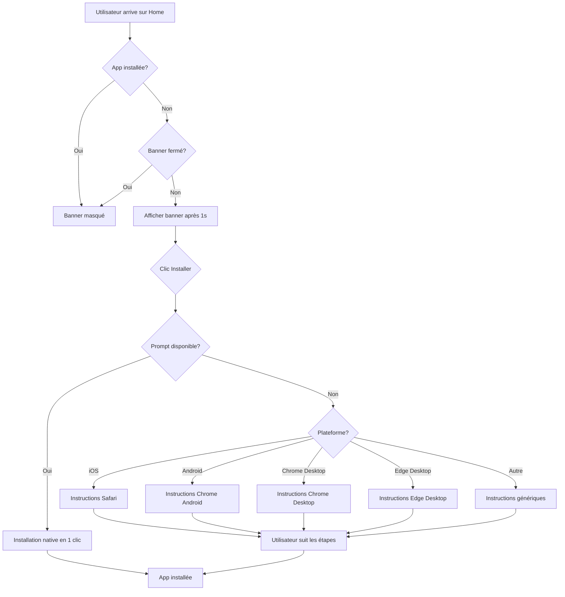

# 📱 Banner d'Installation PWA Amélioré

## ✅ Modifications Apportées

### 1. **Affichage Automatique sur Mobile**
- Le banner s'affiche **toujours** après 1 seconde sur mobile
- Plus besoin d'attendre l'événement `beforeinstallprompt`
- Visible immédiatement pour guider l'utilisateur

### 2. **Instructions Adaptées par Plateforme**
Le message d'installation est maintenant personnalisé selon le navigateur :

#### 🍎 **Safari iOS**
```
1. Cliquez sur le bouton Partager (⬆️)
2. Faites défiler et sélectionnez "Sur l'écran d'accueil"
3. Appuyez sur "Ajouter"
```

#### 🤖 **Chrome Android**
```
1. Cliquez sur le menu (⋮) en haut à droite
2. Sélectionnez "Installer l'application"
3. Confirmez l'installation
```

### 3. **Design Amélioré**

#### Avant ❌
- Fond beige clair (#C0B4A5)
- Texte noir peu contrasté
- Icône statique

#### Après ✅
- **Fond gradient sombre** : `#4E4A43 → #6B5D56 → #8B7D76`
- **Texte blanc** avec text-shadow pour meilleure lisibilité
- **Icône animée** avec effet pulse
- **Bordure beige** (#C0B4A5) en bas pour cohérence visuelle
- **Bouton "Installer"** avec gradient beige et effet tactile

### 4. **Animations**
- **slideDown** : Animation d'entrée fluide (0.4s)
- **pulse** : Animation de l'icône (2s infinite) pour attirer l'attention
- **Effets tactiles** : Scale et shadow sur touch pour feedback visuel

## 🎨 Palette de Couleurs

```css
/* Fond du banner */
background: linear-gradient(135deg, #4E4A43 0%, #6B5D56 50%, #8B7D76 100%);

/* Bordure */
border-bottom: 3px solid #C0B4A5;

/* Icône */
background: linear-gradient(135deg, #C0B4A5 0%, #D4C9BC 100%);

/* Bouton Installer */
background: linear-gradient(135deg, #C0B4A5 0%, #D4C9BC 100%);
color: #2d2d2d;

/* Texte principal */
color: #ffffff;
text-shadow: 0 2px 4px rgba(0, 0, 0, 0.2);

/* Texte secondaire */
color: #D4C9BC;
```

## 📍 Position dans l'Application

Le banner est affiché en **haut de la page Home** :

```jsx
<div className={styles.homeContainer}>
  {/* PWA Install Banner - Affiché en haut sur mobile */}
  <PWAInstallBanner />
  
  {/* Header Mobile-First */}
  <header className={styles.mobileHeader}>
    ...
  </header>
  ...
</div>
```

## 🔧 Fonctionnalités

### Détection Automatique
- ✅ Détecte si l'app est déjà installée
- ✅ Masque le banner si installé
- ✅ Respecte le choix de l'utilisateur (localStorage)

### Installation
1. **Si prompt disponible** : Installation native en 1 clic
2. **Sinon** : Instructions détaillées selon la plateforme

### Fermeture
- Bouton X pour fermer
- Sauvegarde dans localStorage (`pwa-banner-dismissed`)
- Ne réapparaît pas après fermeture

## 📱 Compatibilité

| Plateforme | Support | Instructions |
|------------|---------|--------------|
| Chrome Android | ✅ Natif | Prompt automatique ou manuel |
| Safari iOS | ✅ Manuel | Partager → Écran d'accueil |
| Firefox Android | ✅ Manuel | Menu → Installer |
| Edge Mobile | ✅ Natif | Prompt automatique |
| **Chrome Desktop** | ✅ Natif | Icône ⊕ dans barre d'adresse |
| **Edge Desktop** | ✅ Natif | Menu → Applications → Installer |
| **Firefox Desktop** | ✅ Manuel | Menu → Installer |

## 🚀 Avantages

1. **Visibilité maximale** : Fond sombre avec texte blanc
2. **Guidage clair** : Instructions adaptées par plateforme
3. **Attractif** : Animation pulse sur l'icône
4. **Responsive** : S'adapte à toutes les tailles d'écran
5. **Non intrusif** : Peut être fermé facilement
6. **Persistant** : Sticky en haut de page

## 🎯 Objectif Atteint

✅ **Plus besoin d'utiliser "Ajouter à l'écran d'accueil" manuellement**

L'utilisateur voit maintenant un **banner attractif** dès l'arrivée sur la page Home qui :
- Explique comment installer l'app
- Propose une installation en 1 clic (si disponible)
- Guide vers l'installation manuelle (sinon)

## 📊 Statistiques d'Affichage

Le banner s'affiche si :
- ✅ **Tous les appareils** (Mobile + Desktop)
- ✅ App non installée
- ✅ Banner non fermé précédemment

Le banner ne s'affiche PAS si :
- ❌ App déjà installée
- ❌ Banner fermé par l'utilisateur

## 🔄 Cycle de Vie



## 📝 Code Source

Fichier : `frontend/src/components/PWAInstallBanner.jsx`

Modifications principales :
1. Timer réduit à 1 seconde
2. **Affichage sur tous les appareils** (mobile + desktop)
3. Affichage systématique (pas seulement si prompt)
4. Détection plateforme pour instructions (iOS, Android, Chrome Desktop, Edge Desktop)
5. Design sombre avec meilleur contraste
6. Animation pulse sur l'icône

## 🎉 Résultat

Le banner est maintenant **impossible à manquer** et guide efficacement l'utilisateur vers l'installation de l'application PWA, que ce soit via l'installation native ou manuelle.
